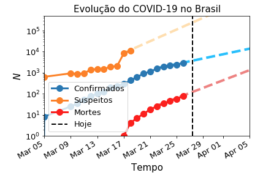
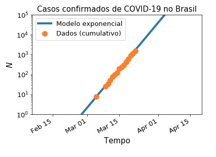
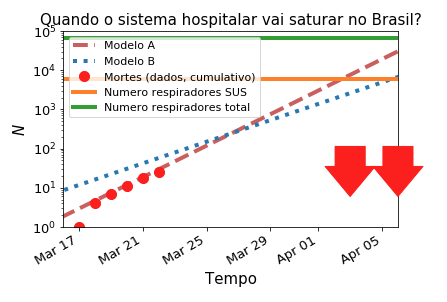

Evolução dos casos de COVID-19 no Brasil
========================================

Inferências da evolução dos casos de COVID-19 no Brasil, contendo vários gráficos de séries temporais. Escrito em Python 3x e Jupyter.

# Usage

Just run the jupyter notebook in this repo to do the simulation. It should be self-explanatory.

# Requirements

See `requirements.txt`.

# Todo

If you have improvements to the code, suggestions of examples, speeding up the code etc, feel free to [submit a pull request](https://guides.github.com/activities/contributing-to-open-source/).

- - - 

[Visit the author's web page](http://rodrigonemmen.com/) and/or follow him on twitter ([@nemmen](https://twitter.com/nemmen)).

